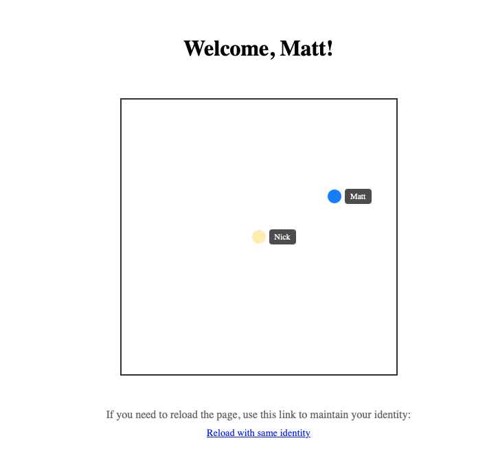

# README

1. Clone the repo
2. bundle install
3. rails db:migrate
4. ./bin/dev

You should see:

```
=> Booting Puma
=> Rails 8.0.2 application starting in development
=> Run `bin/rails server --help` for more startup options
Puma starting in single mode...
* Puma version: 6.6.0 ("Return to Forever")
* Ruby version: ruby 3.4.2 (2025-02-15 revision d2930f8e7a) +PRISM [x86_64-darwin24]
*  Min threads: 3
*  Max threads: 3
*  Environment: development
*          PID: 76700
* Listening on http://127.0.0.1:3000
* Listening on http://[::1]:3000
```

You can enter your name and the mouse position without a box will be tracked with a label. You can open multiple tabs and should see all user's positions on each screen.

1. 
2. 
3. 

# This example is using:

1. Rails 8
2. Propshaft
3. Importmaps
4. SolidCable

# Code layout

The main logic for the realtime communication is in two places:

1. [PositionChannel](app/channels/position_channel.rb)

This channel manages the ActionCable subscription that broadcasts use mouse positions. We simply broadcast all user positions on each update to keep things simple. It would be more efficient to only update single users in the future.

2. [square.js](app/javascript/square.js)

This sets up the ActionCable subscription on the frontend and listens for updated user positions and communicates any changes for the current user to the PositionChannel to broadcast back out.

# SolidCable notes

We are using SolidCable in the development environment to test how that works. The app has the following section for the development environment database.yml:

```yaml
cable:
  <<: *default
  database: storage/development_cable.sqlite3
  migrations_paths: db/cable_migrate
```

And cable.yml:

```yaml
development:
  adapter: solid_cable
  connects_to:
    database:
      writing: cable
  polling_interval: 0.1.seconds
  message_retention: 1.day
```

It wasn't obvious to me how to generate migrations to get solid queue set up. You can create a migration for another database using the following:

`rails generate migration init_solid_cable --database cable`

SolidCable doesn't automatically set up the migration so I needed to copy from the `db/cable_schema.rb` file
